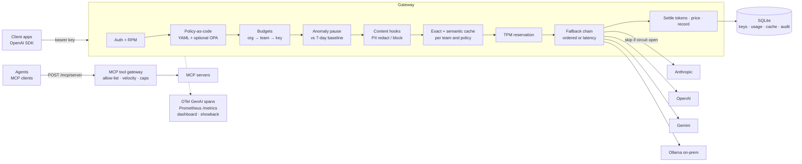

# Governed AI Gateway

[](https://github.com/coreymathie/governed-ai-gateway/actions/workflows/ci.yml)


**A reference implementation of a central AI gateway for regulated financial institutions: one OpenAI-compatible endpoint that decides, per request, who may call which model, where the data may go, what it may cost and what happens when a provider fails, and records each decision as evidence.**

## Executive summary

- **Business problem.** Once several teams call model APIs directly, spend is unbounded and unattributed, a provider outage propagates into every application, and no one can say per request what a call cost, where it went or why. A regulated institution also needs data residency for sensitive workloads and evidence of who changed which control.
- **Architectural approach.** A single gateway is the platform control point between client applications and four providers (OpenAI, Anthropic, Gemini, on-prem Ollama), and between agents and MCP tool servers. Every request passes the same admission pipeline before any provider sees the prompt, then an ordered fallback chain guarded by per-deployment circuit breakers, with opt-in latency-aware routing.
- **Key controls.** Policy as code (YAML, optional OPA) for model allow/deny lists, data residency and request limits; PII redaction hooks with content logging off by default; a hash-chained audit trail of policy decisions and administrative changes, plus a decision trace for every request; an org → team → key budget hierarchy, tokens-per-minute limits, showback/chargeback and spend-anomaly detection modelled on card-fraud velocity checks; an MCP tool gateway with default-deny allow-lists.
- **Evidence.** 290 tests (289 passed, 1 skipped) run offline; a 157-check browser smoke test covers every console screen in both modes (113 demo, 44 live). The semantic cache ships disabled because its **measured** false-hit rate on held-out pairs is 9.1% (1 of 11 hits; 95% upper bound 37.7%) against a 1% target. A route-eval gate fails a routing change that lowers quality or raises cost beyond set limits (**simulated** providers).
- **Out of scope.** Content-level guardrails (prompt-injection classification, output filtering), SSO for administrators, state shared across gateway instances, TLS termination, and any evaluation against real models.

## Live demo

### [Open the live console](https://coreymathie.github.io/governed-ai-gateway/demo/)

[](https://coreymathie.github.io/governed-ai-gateway/demo/)

The console is set in **Cypress Harbor Credit Union**, a *fictional* credit union whose seven teams run eleven AI applications through the gateway; its 90 days of usage and 500-request log are labelled **sample** data. A visitor can read spend against team budgets, open any request to see every control it passed, take a simulated provider down and watch breakers open, edit a policy and preview its decisions, and try allowed and denied MCP tool calls. The hosted console runs the repository's own `router/*.py` modules in the browser via Pyodide against **simulated** providers, with no API keys and no provider calls; `docker compose up` runs the same console live against the gateway. How the console works: [docs/console.md](docs/console.md).

## Problem and context

Once several teams call LLM APIs directly, three things go wrong:

1. **Cost is unbounded and unattributed.** A retry loop or a leaked key spends until someone reads the invoice, and the invoice does not say which team or application did it.
2. **Outages propagate.** When a provider degrades, every request waits for a timeout before anything falls back, and clients keep sending traffic to a provider that is already returning 429s.
3. **No one can answer "what did that cost, and why did it go there?"** per request, per team or per model.

A regulated institution adds constraints. Member data in regulated workloads must stay on infrastructure the institution controls, including when the preferred provider fails. Changes to the controls themselves need an attributable, tamper-evident record. Agents that call tools need least privilege and velocity limits, as payment flows do. Finance needs monthly budgets per team and a chargeback basis it can reconcile. The gateway places one enforcement and accounting point in front of every provider, so those answers come from configuration and data rather than from each application.

### Worked example: a credit union's seven teams (sample)

The console models the operating model for the fictional Cypress Harbor Credit Union. Each team holds gateway keys for its applications; budgets, residency and anomaly limits attach to the team and key, not to the application code. Budgets and volumes are illustrative assumptions in the **sample** data.

| Team | AI applications and route aliases (sample) | Monthly budget (sample) |
|---|---|---|
| Member services | `member-assistant`, `agent-assist` on `smart-fast` | $3,600 |
| Digital banking | `online-banking`, `mobile-banking` on `fast-chat` (latency-aware) | $2,600 |
| Risk analytics | `fraud-scoring-batch` on `heavy-reasoning`; `dispute-triage` on `regulated-fast` (on-prem only) | $4,200 |
| Lending | `loan-doc-extraction` on `smart-fast` and `heavy-reasoning` | $2,000 |
| Compliance | `reg-change-digest` on `heavy-reasoning`; `bsa-case-notes` on `regulated-fast` (on-prem only) | $700 |
| IT | `code-assistant` on `smart-fast` and `heavy-reasoning` | $1,000 |
| Marketing | `content-drafts` on `smart-fast` | $500 |

In the sample, the risk-analytics `fraud-scoring-batch` key is paused on September 24 at 10.2x its 7-day baseline; the spend it prevented ($2,310) is an estimate, not a measurement. The Spend screen shows each team's month-to-date spend, its month-end forecast at the current daily rate, and its budget; showback by team, key and model is the chargeback basis.

## Reference architecture



| Component | Responsibility |
|---|---|
| Admission pipeline | Authentication and RPM, policy (and optional OPA), budgets, anomaly pause, content hooks, exact and semantic cache, TPM reservation. Every stage can refuse a request before any provider is called. |
| Fallback chain | Walks an alias's ordered targets (or latency order), skips deployments whose circuit is open, records each attempt. |
| Settlement | Corrects token reservations to provider-reported usage, prices the call, runs response hooks, writes usage, cache and the opt-in content log. |
| MCP tool gateway | Applies per-team tool allow-lists, velocity windows and daily caps before forwarding one JSON-RPC message upstream. |
| Store | SQLite: hashed application keys, usage, cache, audit trail and content log. |
| Observability | OpenTelemetry GenAI spans, Prometheus metrics, per-request decision traces, admin API, console. |

**Trust boundaries.** (1) Client → gateway carries untrusted input; the caller's team comes from its key, set by an administrator, never from the request. (2) Operator → admin API is privileged and separately authenticated. (3) Gateway → public providers is where data leaves the institution; residency policy removes non-permitted providers before the fallback chain runs. (4) Gateway → OPA carries request metadata only, never content. (5) Agent → gateway → MCP servers crosses the same boundary as model calls, and the gateway decides before forwarding.

**Data flow.** A request is refused with 400/403/413 (policy), 402 (budget), 429 (TPM, RPM or anomaly pause), 422 (PII block) or 503 (policy or hook failure, or all circuits open) before any provider call. A provider error, timeout, 429 or 5xx moves to the next target, and the breaker counts it. Module map and request lifecycle: [docs/architecture.md](docs/architecture.md).

## Design principles

1. **Controls live outside the model and outside the application.** Teams, budgets and policy attach to the gateway key, so an application cannot select a looser policy.
2. **Decide before spending.** Policy, budgets, anomaly pauses, content hooks and rate limits are evaluated before any provider is called.
3. **Fail closed.** A policy-engine error, an unreachable OPA, a failing content hook or an MCP upstream error denies the request; nothing partial is returned.
4. **Policy is reviewable code.** Every control is a schema-validated YAML file; an invalid file stops startup, and a bad reload keeps the previous configuration.
5. **The most restrictive layer wins.** Allow-lists intersect and deny-lists union across defaults, team and route; a route cannot loosen a team rule.
6. **Record metadata, not content.** Usage rows, spans, traces and audit rows hold metadata and counts; content logging is opt-in per team and always redacted.
7. **Measure before enabling.** The semantic cache stays off until calibrated, and routing changes pass a cost/quality gate and shadow comparison first.

## Key decisions and trade-offs

| ADR | Decision | Trade-off or consequence |
|---|---|---|
| [0001](docs/adr/0001-litellm-for-provider-adapters.md) | Use LiteLLM for provider wire formats; own the control plane in dependency-free modules | Adding a provider is a one-line change; LiteLLM becomes a supply-chain dependency on the hot path (version floor, not a pin) |
| [0002](docs/adr/0002-ordered-fallback-and-circuit-breakers.md) | Ordered fallback by default, per-deployment circuit breakers, latency ordering opt-in | Outages stop costing every request a timeout; breaker state is per process, so N workers allow N × `failure_threshold` failures |
| [0003](docs/adr/0003-per-key-baseline-anomaly-model.md) | Judge spend against each key's own baseline (fraud velocity checks), not fixed thresholds | One rule fits keys of any scale and is explainable; slow drift is invisible, and verdicts are cached for 30 s |
| [0004](docs/adr/0004-exact-match-cache-now-semantic-later.md) | Exact-match cache now; semantic cache only with a measured false-hit rate | No false hits, at the cost of missing paraphrases; cached completions are plaintext at rest |
| [0005](docs/adr/0005-semantic-cache-off-by-default-calibrated.md) | Semantic cache ships off; threshold calibrated on half the pairs, reported on the other half | The held-out result misses the 1% target, so enabling it is a per-team decision after local calibration |
| [0006](docs/adr/0006-mcp-tool-gateway-scope.md) | MCP tool gateway: request/response tool calls only, default deny, fraud-style velocity | A small, fully tested surface; no stdio servers, server-initiated streams or upstream OAuth |

## Controls and risk mapping

| Control | Risk addressed | Enforcement point | Evidence |
|---|---|---|---|
| Policy as code: alias and model lists, `max_tokens` ceilings, request limits | Teams using models they are not cleared for; oversized requests | `router/admission.py`, after auth and before budgets | `test_most_restrictive_layer_wins`, `test_max_tokens_reject_and_request_limits` |
| Data residency (`allowed_providers`) | Regulated data reaching a public provider, including through fallback | Policy removes deployments before the fallback chain | `test_regulated_team_blocked_from_external_provider`, `test_regulated_team_routes_local_with_hooks_and_ceiling` |
| Optional OPA, fail closed | Policy bypass when the decision point is down or returns garbage | `router/admission.py`, `router/opa.py` | `test_opa_failures_fail_closed`, `test_policy_engine_crash_fails_closed` |
| PII redaction / block hooks | Member data reaching a provider, the cache or a log | `router/privacy.py`, before the provider call and on the response | `test_route_redaction_reaches_provider_redacted_and_is_audited`, `test_team_block_refuses_before_any_provider_call`, `test_failing_hook_fails_closed` |
| Content logging off by default | Prompts and completions at rest | `router/privacy.py` | `test_content_log_is_opt_in_per_team_and_always_redacted` |
| Audit trail (hash-chained, append-only) | Unattributed or concealed changes to keys, budgets, policy and config; repudiation of policy decisions | `router/audit.py` | `test_audit_log_is_append_only_and_tamper_evident`, `test_admin_actions_are_audited` |
| Decision traces | A single request that cannot be explained | `router/traces.py` | `test_mock_provider_answers_without_keys_and_traces_every_stage` |
| Budget hierarchy org → team → key | Unbounded spend | `router/budgets.py` | `test_org_daily_cap_blocks_every_team`, `test_first_breached_cap_broadest_first` |
| Tokens and requests per minute | One team's burst exhausting shared capacity | `router/tokens.py`, `router/auth.py` | `test_team_tpm_limit_rejects_with_retry_after_and_settles_to_real_usage` |
| Spend-anomaly pause | A runaway loop or leaked key spending under its cap | `router/anomaly.py` | `test_auto_pause_blocks_runaway_key` |
| Showback / chargeback | Unattributed cost | `router/showback.py` | `test_showback_json_and_csv`, `test_csv_escapes_formulas_and_has_unit_columns` |
| Circuit breakers and fallback | Provider outages propagating to every application | `router/fallback.py`, `router/breaker.py` | `test_breaker_opens_and_later_requests_skip_the_dead_provider`, `test_all_circuits_open_returns_503_with_retry_after` |
| MCP default deny and velocity | Excessive agency: agents calling tools they are not cleared for, or in loops | `router/mcp_gateway.py`, `router/mcp_policy.py` | `test_denied_tools_never_reach_the_server`, `test_velocity_identical_calls_and_daily_cap` |
| Cache isolation by team and policy | Cross-team disclosure through cached answers | `router/semcache.py`, `router/routing.py` | `test_cache_never_crosses_teams_policies_or_context` |
| Application keys hashed at rest | Key recovery from the database | `router/store.py` | `tests/test_keys_at_rest.py` |

The audit trail records policy decisions, content-hook actions, MCP tool-call decisions and administrative changes; decision traces hold each request's stage-by-stage timeline in memory. Framework mapping (NIST AI RMF, NIST AI 600-1, FinOps for AI): [docs/controls.md](docs/controls.md). Threats and residual risk (STRIDE, OWASP LLM Top 10 2025): [docs/threat-model.md](docs/threat-model.md). Configuration and full control behaviour: [docs/configuration.md](docs/configuration.md).

## Evaluation and evidence

| Result | Value | Label | How measured, and limits |
|---|---|---|---|
| Test suite | 290 tests: 289 passed, 1 skipped | **measured** | `python -m pytest -q`, offline with LiteLLM's completion call stubbed. The skipped test needs tiktoken's `cl100k_base` encoding. |
| Console smoke | 157 checks passed (113 demo, 44 live) | **measured** | `python scripts/demo_smoke.py --both` in headless Chromium, Pyodide served from a local copy: every screen's key interaction, no console errors, no failed or third-party requests, no horizontal scroll at 390 px or 1366 px. |
| Semantic cache, held-out false-hit rate | 9.1% (1 of 11 hits; 95% upper bound 37.7%) at threshold 0.88; 28.6% with guards off | **measured** | `python scripts/calibrate_semcache.py` on 160 bundled fictional pairs with the hashing embedder; not production traffic. |
| Route evaluation | `smart-fast` 0.975 quality, $0.001200 for 40 cases | **simulated** | Invented provider profiles; tests the harness, fallback and pricing, not model quality. No real-model evaluation has been run. |
| Route-eval gate | Fails `smart-fast` on quality (0.975 → 0.775) or cost (+216%) | **simulated** | `scripts/eval_gate.py`; an example pull-request job, not wired into this repository's CI. |
| OPA policy tests | 8/8 passed on OPA 1.4.2 | **measured** | Run locally; CI does not run OPA. |
| Request log consistency | Each team's cost per 1,000 requests within 30% of the usage file | **sample** | `tests/test_sample_requests.py` over the 500-request log. |

**Why the semantic cache ships disabled.** The threshold chosen on the calibration half (0.88, 0 of 13 hits wrong) misses the 1% target on the held-out half: a dozen hits cannot certify 1%, and the lexical embedder cannot tell "rotate" from "revoke" an API key. A team enabling it calibrates first on pairs labelled from its own traffic, preferably with a provider embedding model. Full calibration table, route results, gate, shadow-mode guarantees and test inventory: [docs/evaluation.md](docs/evaluation.md).

## Operations

- **Observability.** One OpenTelemetry GenAI span per provider attempt (no content), Prometheus metrics at `/metrics`, an `x-router-trace-id` and decision trace for every chat request, routing and policy decisions in `x-router-*` response headers, and the audit trail at `GET /admin/audit` with `GET /admin/audit/verify`.
- **Failure modes.** Every provider failing returns a clean 502; every circuit open returns 503 + `Retry-After` with no provider call; an exhausted org budget returns 402 for every team; a regulated team whose only permitted provider is down gets 502 and public providers are never tried; OPA, policy-engine and hook failures return 503. Thirty failure modes with their tests: [docs/operations.md](docs/operations.md#failure-modes).
- **Deployment options.** SQLite by default; limits and breakers are per process. Details: [docs/operations.md](docs/operations.md#deployment-options).

| Option | Providers | Use |
|---|---|---|
| `uvicorn router.main:app --port 4000` | Real, from keys in `.env` | Development, single-node deployment |
| `docker compose up` | **Simulated** by default | Evaluation; console in live mode at `/console/` |
| `ROUTER_ROUTES_FILE=./config/regulated.yaml` | On-prem Ollama only | Workloads that must stay on the institution's network |
| `OPA_URL` set to an OPA sidecar | Any | A central policy decision point in addition to the local policy file |
| GitHub Pages (`demo/`) | **Simulated**, in the browser | Public demonstration |

## Limitations and residual risk

- Limits, breakers and latency averages are **per process**; multiple workers or instances each enforce their own. `POST /admin/reload` reloads only the worker that receives it.
- Spend caps compare against recorded spend, so in-flight requests can overshoot a cap by their own cost.
- Every request that reaches policy evaluation writes one audit row (plus the usage row); with SQLite that is an extra serialized write per request.
- Cached completions are stored in plaintext SQLite when the cache is on. Application keys are not: only a salted HMAC is stored.
- The semantic cache is in memory per worker; provider embedding calls are not priced or recorded. Its bundled calibration does not meet a 1% false-hit target on held-out pairs.
- PII detection is pattern-based (no names or addresses). Streams cannot be combined with `post_response` hooks.
- The audit chain makes tampering evident, not impossible: anyone who can write the SQLite file can rebuild the chain.
- SQLite serializes writes; heavy concurrent traffic needs a server database. "Today" and "this month" are UTC.
- Request traces, like breakers, are in memory per worker and bounded; the usage table and audit trail are the durable record. Budget overrides and key holds set from the console are in SQLite and shared, but each worker caches budget overrides until it changes them itself.
- `PUT /admin/config/{name}` (off unless `ROUTER_ALLOW_CONFIG_WRITES=true`) rewrites the YAML file, so comments in an edited file are whatever the editor sent; it reloads only the worker that receives it.
- The console's demo mode simulates providers, time (a virtual clock) and the hours before "now" on its overview chart; its budgets are scaled down so they can be hit. Live mode with `ROUTER_MOCK_PROVIDERS=true` simulates providers only.
- Teams that outgrow this design can move to LiteLLM's own proxy, which does far more; the routes file maps over cleanly.

## Roadmap

- SSO (OIDC) for the admin API and dashboard.
- Shared state (Redis) for rate-limit windows and breakers across instances.
- Encrypted cache at rest.
- Signed or digest-pinned policy files; append-only usage records.
- OAuth and per-user identity for upstream MCP servers.
- `opa test policies/` in CI; pinned, hashed dependencies; SRI on the console's CDN script.
- Configurable anomaly thresholds and a seasonality-aware baseline.
- Spend forecasts by team in the gateway API (the console's forecast is computed over sample data).

## Getting started

### Quickstart

```bash
git clone https://github.com/coreymathie/governed-ai-gateway.git
cd governed-ai-gateway
python -m venv .venv && source .venv/bin/activate
pip install -r requirements.txt
cp .env.example .env            # provider keys + ROUTER_ADMIN_KEY
uvicorn router.main:app --port 4000
```

Create a key for an application, then use any OpenAI client:

```bash
curl -X POST http://localhost:4000/admin/keys \
  -H "Authorization: Bearer $ROUTER_ADMIN_KEY" -H "Content-Type: application/json" \
  -d '{"label": "online-banking", "team": "digital-banking"}'
```

```python
from openai import OpenAI

client = OpenAI(api_key="sk-router-...", base_url="http://localhost:4000/v1")
r = client.chat.completions.create(model="smart-fast", messages=[{"role": "user", "content": "Hello"}])
print(r.model)  # the deployment that answered, e.g. "openai/gpt-4.1-mini" after a fallback
```

Showback for the month so far:

```bash
curl -H "Authorization: Bearer $ROUTER_ADMIN_KEY" \
  "http://localhost:4000/admin/showback?group_by=team,model&format=csv" -o showback.csv
```

With Docker and simulated providers: `docker compose up`, then open http://localhost:4000/console/ ([docs/console.md](docs/console.md#run-it-live)). Without Docker, `ROUTER_MOCK_PROVIDERS=true uvicorn router.main:app --port 4000` does the same.

### Running the checks

```bash
pip install -r requirements.txt ruff
ruff check . && ruff format --check .
python -m pytest -q
python scripts/demo_smoke.py --both     # optional: every console screen in headless Chromium (needs playwright)
python scripts/build_console_data.py    # regenerate demo/data/*.json after changing evals, routes or tests
```

### Repository layout

| Path | Contents |
|---|---|
| `router/` | The gateway: API, admission pipeline, policy, budgets, breakers, caches, MCP gateway, telemetry, store |
| `config/` | `routes.yaml`, `policies.yaml`, `regulated.yaml`, MCP example and mock configs |
| `policies/` | Example OPA policy and its tests |
| `demo/` | The console (static app, demo and live adapters) and its committed sample data |
| `dashboard/` | The classic server-rendered dashboard |
| `evals/` | Route-eval cases, simulated provider profiles, semantic-cache pairs |
| `scripts/` | Eval, gate, calibration, sample-data generators, console smoke test |
| `tests/` | The offline test suite |
| `docs/` | [Architecture](docs/architecture.md), [configuration](docs/configuration.md), [operations](docs/operations.md), [evaluation](docs/evaluation.md), [console](docs/console.md), [controls](docs/controls.md), [threat model](docs/threat-model.md), [ADRs](docs/adr/) |

### License

MIT.
