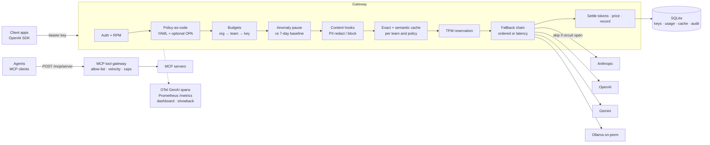

# Governed AI Gateway

[](https://github.com/coreymathie/governed-ai-gateway/actions/workflows/ci.yml)


**A governed AI gateway: one OpenAI-compatible control plane in front of OpenAI, Anthropic, Gemini and on-prem Ollama that decides, per request, who may call which model, what it may cost, and what happens when a provider fails. It addresses the risks that appear once many teams call model APIs directly: uncontrolled spend, provider outages that reach every application, and model and tool use that no one governs. Each request passes a staged pipeline of policy, budgets, anomaly detection and fallback, and every decision is traced.**

## At a glance

| | |
|---|---|
| **Problem** | Teams calling LLM APIs directly produce spend no one can bound or attribute, outages that propagate to every app, and model and tool calls with no policy or audit trail. |
| **Architecture** | One enforcement and accounting point: auth → policy → budgets → anomaly → content hooks → cache → TPM → fallback chain with circuit breakers → settle. An MCP tool gateway applies the same governance to agent tool calls. |
| **Key decisions** | LiteLLM for wire formats, control plane in dependency-free modules; ordered fallback with per-deployment breakers; anomalies judged against each key's own baseline; semantic cache off until calibrated; MCP default deny. Recorded in [6 ADRs](#key-decisions). |
| **Controls** | Org → team → key budgets, TPM/RPM limits, spend-anomaly pause, policy-as-code (YAML, optional OPA) with data residency, PII redaction hooks, hash-chained audit trail, showback. [Mapped to](docs/controls.md) NIST AI RMF / AI 600-1 and FinOps capabilities. |
| **Evidence** | 290 tests, a 157-check headless-browser smoke test of the console, 6 ADRs, a [threat model](docs/threat-model.md). Route evals use a deterministic simulation, not real-model measurements. |
| **Try it** | [Live console](https://coreymathie.github.io/governed-ai-gateway/demo/): this repo's `router/*.py` modules running in the browser against simulated providers. Or `docker compose up`. |

### ▶ [Open the live console](https://coreymathie.github.io/governed-ai-gateway/demo/)

[](https://coreymathie.github.io/governed-ai-gateway/demo/)

The hosted console runs this repo's actual `router/*.py` modules in the browser via Pyodide against **simulated** providers (no API keys, no provider calls); `docker compose up` runs the same console live against the real gateway. See [Console](#console).

---

## The problem

Once several teams call LLM APIs directly, four things go wrong:

1. **Cost is unbounded and unattributed.** A retry loop or a leaked key spends until someone reads the invoice, and the invoice doesn't say which team or app did it.
2. **Outages propagate.** When a provider degrades, every request waits for a timeout before anything falls back, and clients keep sending traffic to a provider that is already returning 429s.
3. **Model and tool use is ungoverned.** Nothing stops a team from sending regulated data to a public provider, and agents call tools that can close a ticket, read a file or move money, with no allow-list, rate limit or audit trail.
4. **No one can answer "what did that cost, and why did it go there?"** per request, per team, or per model.

The design goal is one enforcement and accounting point in front of every provider and tool server, so those answers come from reviewable config and recorded data rather than from each application's code.

## Architecture



Design principles:

- **Refuse before spending.** Auth, policy, budgets, anomaly checks, content hooks and the TPM reservation all run before any provider call, so a refusal costs nothing.
- **Fail closed on governance, fail over on providers.** A policy engine error, an unreachable OPA or a content hook that raises returns 503 with nothing sent. A provider error, timeout or 429 moves to the next target in the alias.
- **Own the control plane, not the wire formats.** Provider calls go through LiteLLM; the control modules carry no LiteLLM types, which is why the same code runs unchanged in the browser console ([ADR 0001](docs/adr/0001-litellm-for-provider-adapters.md)).
- **Config is the policy.** Routes, policies and MCP allow-lists are schema-validated YAML files, reviewable in a pull request; a bad reload keeps the previous routes and policies. Every behavior below has an offline test.
- **Every decision is traced.** Each request gets an `x-router-trace-id` and a per-stage trace (metadata only), and governance actions are written to a hash-chained audit trail.

Module map and request lifecycle: [docs/architecture.md](docs/architecture.md).

## Key decisions

Each decision is recorded as an ADR with its context, alternatives and consequences. The trade-off column is taken from each ADR's consequences.

| ADR | Decision | Trade-off |
|---|---|---|
| [0001](docs/adr/0001-litellm-for-provider-adapters.md) | Use LiteLLM for provider wire formats; own the control plane in dependency-free modules | LiteLLM is a supply-chain dependency on the hot path, and `requirements.txt` sets a floor, not a pin, so production deployments should pin and review upgrades. Its price catalog can lag new models (covered by `prices:` overrides). |
| [0002](docs/adr/0002-ordered-fallback-and-circuit-breakers.md) | Ordered fallback by default, per-deployment circuit breakers, latency ordering opt-in | Breaker state is per process: with N workers a provider can take up to N × `failure_threshold` failures before every worker opens. Half-open probes are real user requests, and latency ordering can keep a stale average, which is why the default stays ordered. |
| [0003](docs/adr/0003-per-key-baseline-anomaly-model.md) | Judge spend against each key's own baseline (fraud velocity checks), not fixed thresholds | Slow drift is invisible by design (a key growing 2x per week never crosses 3x of its trailing baseline; budgets cover that), legitimate launch-day growth can be flagged, and the 30 s evaluation cache lets a key keep spending for up to 30 s after crossing 10x. |
| [0004](docs/adr/0004-exact-match-cache-now-semantic-later.md) | Exact-match cache now; semantic cache only with a measured false-hit rate | No false hits, at the cost of missing paraphrased repeats. Cached completions are stored in plaintext SQLite. |
| [0005](docs/adr/0005-semantic-cache-off-by-default-calibrated.md) | Semantic cache ships off; threshold calibrated on half the pairs, reported on the other half | Enabling it is an explicit per-team decision after calibrating on that team's traffic. Entries are in memory per worker and lost on restart; provider embedding calls are not priced or recorded. |
| [0006](docs/adr/0006-mcp-tool-gateway-scope.md) | MCP tool gateway: request/response tool calls only, default deny, fraud-style velocity | A deliberately small surface: no stdio servers, server-initiated streams, resumability, server-to-client requests, resources, prompts, OAuth or per-user upstream identity. LLM budgets don't gate tool calls; per-tool `daily_usd` caps do. |

## FinOps and risk controls

All of these are decided **before** a provider is called.

| Control | Behavior | Config |
|---|---|---|
| Budget hierarchy | Org, team and key caps, daily and monthly (UTC). Broadest scope checked first; 402 when a cap is reached. Team/key overrides inherit unset fields. | `policies.per_*_usd`, `budgets:` |
| Tokens per minute | Per key and per team. An estimate (prompt + `max_tokens`) is reserved, then corrected to provider-reported usage; released if every provider fails. 429 + `Retry-After`. | `policies.per_*_tpm`, `budgets.*.tpm` |
| Requests per minute | Per key. | `policies.rate_limit_rpm` |
| Spend anomalies | This hour vs. the key's 7-day baseline: flagged at 3x, auto-paused (429) at 10x if enabled. | `policies.auto_pause_on_anomaly` |
| Showback / chargeback | `GET /admin/showback?group_by=team,key,model,provider&format=csv` with cost, tokens, cost per 1K requests, cost per 1K tokens, share of cost. Keys appear as label + fingerprint, never the secret. | admin key |
| Price overrides | Negotiated or self-hosted rates (USD per 1M tokens) take precedence over LiteLLM's catalog. Unpriced models are flagged at startup and on `/health`. | `prices:` |
| Data residency | A team's `allowed_providers` in `config/policies.yaml` removes every other provider from any route it calls, fallback included; `config/regulated.yaml` is a routes file with only on-prem Ollama. | `policies.teams.<team>`, separate routes file |

What "enforced" means precisely: caps compare against spend already recorded, so concurrent in-flight requests can overshoot a cap by their own cost, and all limits are per gateway process.

### Privacy and audit controls

| Control | Behavior | Config |
|---|---|---|
| PII redaction hooks | `pre_request` hooks run over message contents before any provider call; `post_response` hooks run over the completion before it reaches the client, the cache or the content log. Built-ins: `pii_redact` (emails, phones, SSNs, Luhn-valid cards, API-key-like secrets → `[REDACTED:KIND]`), `pii_block` (422), `pii_detect` (audit only). Layers union: default + route + team. Responses carry `x-router-content-hooks` and `x-router-redactions` (counts only). | `privacy:` in routes.yaml |
| Custom hooks | `register_hook(name, fn)` in a module listed in `ROUTER_HOOK_MODULES`; unknown hook names fail config validation. A hook that raises fails the request closed (503, nothing sent). | `ROUTER_HOOK_MODULES` |
| Content logging | Off by default: usage rows, logs, spans and the audit trail hold metadata only. A team opts in with `log_content: true`; stored prompts and completions are then redacted with every detector and truncated. `GET /admin/content-log`. | `privacy.teams.<team>.log_content` |
| Audit trail | Every hook action (redact, block, detect, hook error), every content-log write, and admin key creation, revocation and reloads are appended to `audit_log` with counts, never matched values. Rows are hash-chained; triggers refuse UPDATE/DELETE; `GET /admin/audit/verify` finds the first altered row. | always on |

Pattern-based detection misses PII it has no pattern for (names, street addresses, numbers spelled out) and can flag look-alikes. It reduces what reaches a provider or a log; it doesn't guarantee it.

How these controls map to NIST AI RMF / AI 600-1 and FinOps capabilities (a self-assessed mapping, not a certification): [docs/controls.md](docs/controls.md). Threats and residual risks (STRIDE, OWASP LLM Top 10 2025): [docs/threat-model.md](docs/threat-model.md).

## Policy-as-code

`config/policies.yaml` is evaluated before budgets, cache or any provider call ([router/policy.py](router/policy.py)). Layers combine so the most restrictive wins: `defaults` → `teams.<team>` → `routes.<alias>`.

```yaml
defaults:
  max_tokens_ceiling: 4096        # also sent when a request doesn't set max_tokens
  max_tokens_mode: clamp          # or reject (400)
  max_request_bytes: 262144       # serialized messages; 413 above it
  max_messages: 200
teams:
  regulated:
    allowed_providers: [ollama]   # public providers are removed from every route, fallback included
    required_hooks: [pii_redact]  # runs even if the team's privacy config has no hooks
    max_tokens_ceiling: 2048
  contractors:
    allow_aliases: [smart-fast, cheap-batch, local-first]
    deny_models: ["anthropic/claude-sonnet-*", "openai/gpt-4.1"]
```

| Behavior | Detail | Evidence |
|---|---|---|
| Schema validation | Unknown keys, providers, modes, unregistered hooks and malformed globs are errors. An invalid file stops startup; a bad `POST /admin/reload` returns 400 and keeps the previous routes **and** policies. | `test_schema_errors`, `test_reload_is_atomic_and_missing_explicit_file_fails` |
| Combination | Allow-lists intersect, deny-lists union, ceilings take the smallest, `reject` beats `clamp`, required hooks union. A route can't loosen a team rule. | `test_most_restrictive_layer_wins` |
| Decisions | Removed deployments are never tried. Nothing left → 403. Alias not allowed → 403; over-size → 413; over the ceiling → 400 or clamped. | `test_regulated_team_blocked_from_external_provider`, `test_regulated_team_routes_local_with_hooks_and_ceiling`, `test_max_tokens_reject_and_request_limits` |
| Visibility | `x-router-policy`, `x-router-policy-rules`, `x-router-policy-source`, `x-router-policy-removed`, `x-router-policy-max-tokens`; every decision is an audit row; `GET /admin/policies?team=&alias=` shows the effective rule. | `test_admin_policies_shows_effective_rule` |
| Optional OPA | With `OPA_URL` set, OPA must also allow (`POST /v1/data/<opa.path>`, input is metadata only, never content). OPA can narrow the route via `allowed_targets`, never widen it. Timeouts, errors, non-200, undefined or malformed results → 503 (fail closed). | `test_opa_allow_deny_narrow_and_input_has_no_content`, `test_opa_failures_fail_closed` (fake OPA over real HTTP) |
| Body size | `ROUTER_MAX_BODY_BYTES` (default 1 MiB) refused with 413 before parsing, including chunked bodies. | `test_body_size_middleware_refuses_before_parsing` |

[policies/router.rego](policies/router.rego) is an example OPA policy (local-only teams, off-peak batch alias, org-wide `max_tokens`, model deny list) with its own tests: `opa test policies/` passed 8/8 locally on OPA 1.4.2, and the gateway was checked against a real `opa run --server` with that policy. CI doesn't run OPA.

## Resilience

The route file is the policy: operators can read it, diff it in a pull request and roll it back. Resilience is layered on top without making routing non-deterministic by default.

- **Ordered fallback.** Any provider error, timeout or 429 moves to the next target in the alias.
- **Circuit breakers per `provider/model`.** Closed → open after N consecutive failures or an error-rate threshold in a sliding window, or immediately when a 429/503 carries `Retry-After`. Open → half-open after the cooldown; limited probes; closed again on success. Caller errors (400, 422) don't count. If every target is open: **503 + `Retry-After`** with no provider call.
- **Latency-aware routing (opt-in).** `strategy: latency` orders healthy targets by an EWMA of observed latency (time-to-first-token for streams). Near-ties within 10% keep the configured order; new deployments get a short warm-up. Routes without it are unchanged.
- **Streaming.** Fallback before the first chunk; a mid-stream failure ends the stream with an error event. Tokens received are recorded when the stream ends or the client disconnects.
- **Visible routing.** `x-router-used-provider`, `x-router-used-model`, `x-router-cache`, `x-router-strategy`, `x-router-attempts`, `x-router-fallback-from`, `x-router-circuit-skipped`.

```yaml
aliases:
  smart-fast:                       # configured order
    - { provider: anthropic, model: claude-haiku-4-5, timeout_s: 20 }
    - { provider: openai,    model: gpt-4.1-mini,     timeout_s: 20 }
    - { provider: ollama,    model: llama3.1:8b,      timeout_s: 60 }
  fast-chat:                        # fastest healthy first
    strategy: latency
    targets:
      - { provider: anthropic, model: claude-haiku-4-5 }
      - { provider: openai,    model: gpt-4.1-mini }

resilience:
  circuit_breaker: { failure_threshold: 5, error_rate_threshold: 0.5, min_requests: 10,
                     window_seconds: 60, cooldown_seconds: 30, half_open_max_probes: 1 }
  latency: { alpha: 0.3, min_samples: 3, tolerance: 0.10 }

budgets:
  org:   { daily_usd: 2000, monthly_usd: 40000 }
  teams: { data: { daily_usd: 200, tpm: 400000 } }
  keys:  { fraud-scoring-batch: { monthly_usd: 300 } }
```

Full annotated file: [config/routes.yaml](config/routes.yaml) (the budget figures above are examples; the shipped file leaves org/team overrides empty).

## Quality (measured)

```bash
pip install -r requirements.txt ruff
ruff check . && ruff format --check .
python -m pytest -q
python scripts/demo_smoke.py --both     # optional: every console screen in headless Chromium, demo + live (needs playwright)
python scripts/build_console_data.py    # regenerate demo/data/*.json after changing evals, routes or tests
```

Latest local run: **289 passed, 1 skipped (290 tests)**. Console smoke (`--both`, Pyodide served from a local copy): **157 checks passed (113 demo, 44 live)**: every screen's key interaction in both modes, no console errors, no failed or third-party requests, no horizontal scroll at 390 px or 1366 px. The skipped test checks the tiktoken estimator and only runs when tiktoken can load its `cl100k_base` encoding (it downloads it on first use). Tests stub LiteLLM's completion call, so they run offline without provider keys.

| File | Tests | Covers |
|---|---|---|
| `test_breaker.py` | 17 | Every breaker transition on an injected clock; error-rate window; Retry-After (seconds and HTTP-date, capped); which errors count; probe slots |
| `test_latency_and_chain.py` | 14 | EWMA math, warm-up, tolerance ties, TTFT vs latency; fallback chain skips, 503 hints, cancellation releasing probes |
| `test_tokens_budgets_showback.py` | 21 | Heuristic and tiktoken estimates, TPM windows, settle/release, budget hierarchy order and inheritance, showback unit metrics, CSV formula escaping |
| `test_v05_api.py` | 22 | Breakers, headers and metrics through the HTTP API; half-open recovery; provider 429 Retry-After; latency routes; TPM 429; org/team caps; showback JSON/CSV; GenAI spans; config validation; early stream close |
| `test_evals_shadow.py` | 22 | Case validation and scoring, simulation determinism and profiles, fallback/errors/cost/latency in replays, judge hook, gate decisions, pinned simulated numbers for the shipped routes, real runs refused without keys, both CLI scripts; shadow mirroring off the books, failure isolation, candidate policy, redaction and required hooks, billing suppress, daily cap, sampling, streams, config validation |
| `test_mcp_gateway.py` | 20 | MCP config schema and example file, allow-list/velocity/identical-call/day-count/spend decisions, tools/list filtering, nested argument redaction; through the proxy with a fake MCP server: initialize and session/auth headers, notifications, filtered tools/list, allowed calls forwarded, recorded, priced and audited redacted, tool-level errors, denials never reaching the server, velocity and daily caps, upstream failures and missing credentials, SSE replies, forward_redacted, protocol edge cases |
| `test_semcache.py` | 12 | Embedder determinism and normalization, number/negation guards, threshold/guard/partition/TTL/LRU, Wilson bound and pick rules, pinned bundled calibration numbers, calibration script, semantic hits through the API at $0, guard and threshold misses, isolation across teams/policies/context/parameters, disabled/creative/streaming, provider embedder and its failure, per-team opt-in and thresholds |
| `test_policy.py` | 39 | Policy schema errors, layer combination, alias/size/message limits, max_tokens reject/clamp/unset, provider and model lists, shipped regulated profile, OPA narrowing and fail-closed results, decision fingerprints; through the API: residency deny and local-only routing with no public fallback, streams, limits, body-size middleware, a fake OPA server (allow, deny, narrow, undefined, 500, garbage, down), OPA enabled without URL, engine crash, atomic reload, `/admin/policies`, cache isolation across policy changes |
| `test_privacy.py` | 30 | Every PII detector and its false-positive guards (Luhn, never-issued SSN ranges), hook order/block/failure, config validation, redaction through the API, team block, post-response hooks, opt-in redacted content log, fail-closed hooks, streaming rules, cache/policy isolation, custom hook modules, append-only hash-chained audit, admin actions audited |
| `test_demo_engine.py` | 19 | The browser demo's engine under CPython (including the governance panel's policy and content stages, that its rules equal `config/policies.yaml`, the semantic-cache panel and that in-browser calibration equals the script's, and the MCP panel with config equal to `config/mcp.example.yaml`), and that the modules it loads stay free of third-party imports |
| `test_console_api.py` | 17 | Live console endpoints: simulated providers (answers, outage fallback, 502 when all down, streaming, knob validation), trace stages and order and that traces hold no prompt text, refusals naming the stage that refused, budget overrides winning over routes.yaml, admin pause/unpause and the anomaly override, config read/validate/apply (YAML and schema errors with lines, writes off by default, atomic apply changes enforcement), policy dry runs on candidate text, overview roll-up, simulated MCP server, admin key file (0600, created once), version consistency |
| `test_demo_console.py` | 10 | The console's demo engine: same stage order and trace shape as the gateway, aliases equal `config/routes.yaml` and profiles equal `evals/sim_profiles.json`, fallback/breakers, residency and clamps, exact and semantic cache, keys/holds/revocation/budgets, runaway batch job paused then overridden, overview history, config screens using the gateway's loaders (pydantic for routes) |
| `test_console_data.py` | 2 | `demo/data/*.json` equal what the eval scripts produce now, and say what is simulated vs. measured |
| `test_api.py`, `test_v04_streaming_cache.py`, `test_anomaly.py`, `test_config_and_store.py` | 26 | Fallback, clean 502s, spend caps, anomaly thresholds and auto-pause, streaming with LiteLLM's real chunk objects, cache scoping and expiry, metrics, admin auth, schema migration |

## Failure modes

Each row is a designed response to a specific failure, pinned by a named test.

| Situation | What the gateway does | Evidence |
|---|---|---|
| Primary provider down | Falls back; after `failure_threshold` failures the breaker opens and later requests skip it | `test_breaker_opens_and_later_requests_skip_the_dead_provider` |
| Provider recovers | After cooldown, one probe; success closes the breaker | `test_half_open_probe_closes_the_breaker_when_provider_recovers` |
| Provider returns 429 + Retry-After | Breaker opens for that long (capped) | `test_provider_429_retry_after_is_honoured` |
| Every provider failing | 502 with a clean message (no upstream detail) | `test_all_providers_failing_returns_clean_502` |
| Every circuit open | 503 + `Retry-After`, no provider call | `test_all_circuits_open_returns_503_with_retry_after` |
| Caller sends a bad request (400) | Falls through, but breakers aren't tripped | `test_bad_request_does_not_trip_breaker` |
| Provider dies mid-stream | Error event to the client, partial usage recorded | `test_mid_stream_failure_sends_error_event_and_records_it` |
| Client disconnects mid-stream | Tokens received so far recorded | `test_stream_closed_early_is_still_recorded` |
| Team bursts past its TPM | 429 + `Retry-After`; other teams unaffected | `test_team_tpm_limit_rejects_with_retry_after_and_settles_to_real_usage` |
| Org budget exhausted | 402 for every team | `test_org_daily_cap_blocks_every_team` |
| Runaway key | Flagged at 3x baseline, 429 at 10x if auto-pause is on | `test_auto_pause_blocks_runaway_key` |
| Invalid routes file on reload | 400, previous config kept | `test_bad_reload_keeps_previous_config` |
| Model missing from price catalog | Warning at startup, listed on `/health`; calls record $0 unless `prices:` overrides it | `router/costs.py` |
| Regulated team calls a route with only public providers | 403 before any provider call; audit `deny` | `test_regulated_team_blocked_from_external_provider` |
| Regulated team's only permitted (local) provider is down | 502; public providers in the same route are never tried | `test_regulated_team_routes_local_with_hooks_and_ceiling` |
| OPA unreachable, erroring or returning no decision | 503, no provider call (fail closed) | `test_opa_failures_fail_closed` |
| Policy engine raises | 503, `error` audit row | `test_policy_engine_crash_fails_closed` |
| Policy file invalid at startup or on reload | Startup fails; reload returns 400 and keeps the previous routes and policies | `test_reload_is_atomic_and_missing_explicit_file_fails` |
| Body over `ROUTER_MAX_BODY_BYTES` | 413 before the JSON is parsed | `test_body_size_middleware_refuses_before_parsing` |
| MCP tool outside the team's allow-list | JSON-RPC `-32001`; the server is never called; audit `deny` | `test_denied_tools_never_reach_the_server` |
| Agent repeats the same tool call in a loop | `-32002` + `Retry-After` after `max_identical_per_minute` | `test_velocity_identical_calls_and_daily_cap` |
| MCP server down or its credential missing | `-32004`, no partial result; audit `upstream_error` | `test_upstream_failures_and_missing_credentials_fail_closed` |
| Shadow candidate fails or times out | Live response unaffected; error row in `shadow_usage`; only the shadow breaker counts it | `test_shadow_failure_never_touches_the_live_path` |
| Shadow candidate not permitted for the caller's team | Not mirrored; `skipped_policy` audit row | `test_shadow_respects_the_candidates_policy` |
| Real eval run without provider keys | Refused with the list of missing credentials (exit 2) | `test_real_runs_refuse_without_credentials` |
| Prompt contains PII on a `pii_block` route/team | 422 before any provider call; audit row with counts | `test_team_block_refuses_before_any_provider_call` |
| A content hook raises | 503, nothing sent to a provider (fail closed); `hook_error` audit row | `test_failing_hook_fails_closed` |
| `post_response` hook blocks a completion | 422 to the client; the provider call is still recorded and billed | `test_post_response_redact_and_block` |
| `stream: true` where a `post_response` hook applies | 400 before any provider call (chunk-wise redaction can miss matches split across chunks) | `test_streaming_with_pre_hooks_and_refused_with_post_hooks` |
| Content policy changes while answers are cached | Cache key includes the hook-set fingerprint, so old entries aren't served | `test_cache_entries_do_not_cross_a_content_policy_change` |

## Observability

- **OpenTelemetry GenAI spans.** One CLIENT span per provider attempt, named `chat {model}`, with `gen_ai.operation.name`, `gen_ai.provider.name`, `gen_ai.request.model`, `gen_ai.usage.input_tokens/output_tokens`, `error.type`, plus `router.cost_usd`, `router.alias`, `router.attempt`. A no-op if OpenTelemetry isn't installed; nothing is exported unless you configure an exporter. Prompts and completions are never put on spans.
- **Prometheus** at `/metrics` (admin key): requests by outcome (ok, error, skipped, cache_hit), spend, tokens, cache savings, rejections by reason, breaker state and transitions, latency EWMA, TPM in use.
- **Request traces:** every chat request gets an `x-router-trace-id` header and a trace (`GET /admin/traces`, `GET /admin/traces/{id}`): each stage's decision, a one-line summary and its wall time. Metadata only (team, key label and fingerprint, alias, deployments, statuses, tokens, cost), never prompt or completion text; a bounded in-memory buffer per worker (`ROUTER_TRACE_BUFFER`, default 500).
- **Policy actions:** `router_policy_actions_total{category,action}` counts what the audit trail records; `router_shadow_requests_total{alias,candidate,outcome}` counts mirrors; `router_mcp_tool_calls_total{server,tool,decision}` counts tool calls.
- **Console** at `/console/` (see [Console](#console)) and the classic dashboard at `/dashboard`.
- **Admin API:** `/admin/circuits`, `/admin/circuits/reset`, `/admin/budgets`, `/admin/budgets/{scope}/{name}`, `/admin/showback`, `/admin/anomalies`, `/admin/usage/today`, `/admin/recent`, `/admin/keys`, `/admin/keys/{id}/pause`, `/admin/keys/{id}/unpause`, `/admin/key-holds`, `/admin/reload`, `/admin/routes`, `/admin/policies`, `/admin/policies/dry-run`, `/admin/config`, `/admin/config/{name}` (+ `/validate`), `/admin/overview`, `/admin/traces`, `/admin/shadow`, `/admin/semantic-cache`, `/admin/mcp`, `/admin/mock/providers`, `/admin/audit`, `/admin/audit/verify`, `/admin/content-log`.

## MCP tool gateway

A tool call can do more damage than a completion, and agent loops repeat calls quickly. `POST /mcp/{server}` puts the same governance in front of [Model Context Protocol](https://modelcontextprotocol.io) tool servers ([router/mcp_gateway.py](router/mcp_gateway.py), [router/mcp_policy.py](router/mcp_policy.py), [ADR 0006](docs/adr/0006-mcp-tool-gateway-scope.md)). Configure it from [config/mcp.example.yaml](config/mcp.example.yaml):

```yaml
servers:
  tickets: { url: http://127.0.0.1:9101/mcp, headers_from_env: { Authorization: MCP_TICKETS_AUTH } }
teams:
  support:
    - { server: tickets, tool: "search_*" }
    - { server: tickets, tool: close_ticket, per_minute: 5, per_day: 200 }
```

| Control | Behavior | Evidence |
|---|---|---|
| Default deny, per-team allow-lists | `tools/list` shows only allowed tools; other `tools/call`s get JSON-RPC `-32001` and never reach the server; a team with no entry for a server gets 403 | `test_denied_tools_never_reach_the_server`, `test_initialize_list_and_notifications_pass_through` |
| Velocity (fraud-style) | Per key per tool and per team per tool calls/minute; an identical-call limit (same tool and arguments) that stops agent loops; `-32002` + `Retry-After` | `test_velocity_identical_calls_and_daily_cap`, `test_check_call_allow_list_velocity_identical_and_caps` |
| Count and spend caps | Daily calls and USD per team per tool, read from the usage table (survive restarts); `-32003` | `test_velocity_identical_calls_and_daily_cap` |
| Argument redaction | Audit rows keep PII-redacted argument values (or keys only); `forward_redacted` sends redacted arguments upstream too | `test_allowed_call_is_forwarded_recorded_and_audited_with_redaction`, `test_sse_replies_and_forward_redacted` |
| Audit and accounting | Every `tools/call` decision is an audit row; allowed calls are usage rows (`provider: mcp`) priced at `cost_usd`, visible in showback; `router_mcp_tool_calls_total` | `test_allowed_call_is_forwarded_recorded_and_audited_with_redaction` |
| Fail closed | Upstream down, non-2xx, malformed, or its credential variable unset → `-32004`, nothing partial; unset credentials mean the server isn't called at all | `test_upstream_failures_and_missing_credentials_fail_closed` |

**Scope:** the request/response part of the Streamable HTTP transport (JSON or SSE replies), with `initialize`, `ping`, `notifications/*`, `tools/list` and `tools/call`. Not proxied: stdio servers, batches, GET streams, DELETE, resumability, server-to-client requests, resources and prompts. Clients authenticate with their gateway key; upstream servers get static headers from environment variables (no OAuth). Tested against a fake MCP server over real HTTP, not third-party servers.

## Semantic cache

[router/semcache.py](router/semcache.py) serves a cached answer when a new prompt's last user turn is similar enough to a cached one ([ADR 0005](docs/adr/0005-semantic-cache-off-by-default-calibrated.md)). A false hit returns a confident answer to a different question, so the false-hit rate governs whether it is used at all. It is **off by default**.

- **Embedder:** offline deterministic hashing (word and character n-grams) by default; a provider embedding model with `embedder: provider`.
- **False-hit guards:** a hit also needs the same numbers and the same negation in both prompts.
- **Isolation:** entries are partitioned by team, alias, policy decision, content hooks, earlier messages, `max_tokens` and embedding space (`test_cache_never_crosses_teams_policies_or_context`). Per-team opt-in (`teams`) and per-team thresholds (`team_thresholds`).
- **Visibility:** `x-router-cache: semantic-hit`, `x-router-semantic-similarity`, `x-router-semantic-match` (`hit`, `below_threshold`, `guard-numbers-differ`, …); `router_semantic_cache_total`; `GET /admin/semantic-cache`.

**Calibration, measured** (`python scripts/calibrate_semcache.py`; bundled fictional pairs, hashing embedder, target ≤1% of hits wrong; pinned by `test_bundled_pairs_calibration_numbers`):

| 160 labeled pairs, split in half | Threshold | Hit rate | False-hit rate |
|---|---|---|---|
| Calibration half | 0.88 (chosen) | 30.9% | 0.0% (0 of 13 hits) |
| Held-out half | 0.88 | 26.3% | **9.1%** (1 of 11 hits; 95% upper bound 37.7%) |
| Held-out half, guards off | 0.88 | 26.3% | 28.6% (4 of 14 hits) |

The chosen threshold misses the 1% target on held-out pairs: a dozen hits can't certify 1%, and the lexical embedder can't tell "rotate" from "revoke" an API key. That is why it ships off. Calibrate on pairs labeled from your own traffic, preferably with a provider embedding model, before enabling it for a team. These numbers describe this embedder on this small synthetic set, not production traffic.

## Evaluating route changes

Routing changes are measured before they ship: offline first, then on live traffic.

**Offline replay** ([router/evals.py](router/evals.py), [scripts/eval_routes.py](scripts/eval_routes.py)): a JSONL set of prompts with reference answers (`exact`, `contains`, `regex`; optional judge hook `module:function`) is replayed through each route with the gateway's own fallback chain and pricing, producing a cost-versus-quality report in Markdown and JSON. [evals/sample_cases.jsonl](evals/sample_cases.jsonl) bundles 40 fictional cases (math, extraction, classification, formatting, reasoning, summary).

```bash
python scripts/eval_routes.py --aliases smart-fast,cheap-batch --out reports/eval        # simulated (default)
python scripts/eval_routes.py --provider real --aliases cheap-batch                     # refused unless every key is set
```

The default provider is a **deterministic simulation**: each deployment answers a case correctly with a probability from [evals/sim_profiles.json](evals/sim_profiles.json) (invented numbers, not measurements of any model). It tests the harness, the routes' fallback behavior and their pricing; it says nothing about how real models perform. No real-model evaluation has been run for this repository. Simulated result for the shipped routes (seed `eval-v1`, pinned by `test_shipped_routes_simulated_report_numbers`):

| Route (simulated providers) | Quality | Cost for 40 cases | p50 latency |
|---|---|---|---|
| `smart-fast` (haiku → gpt-4.1-mini → llama3.1) | 0.975 | $0.001200 | 0.659 s |
| `heavy-reasoning` (sonnet → gpt-4.1) | 0.950 | $0.003789 | 1.411 s |
| `cheap-batch` (gpt-4.1-nano → gemini flash) | 0.775 | $0.000155 | 0.305 s |
| `local-first` (llama3.1 → haiku) | 0.650 | $0.000050 | 1.243 s |

With 40 cases one case is 0.025 of quality, so a profile of 0.96 can score below one of 0.90 by chance (as `heavy-reasoning` vs `smart-fast` does here). Size the case set and the gate threshold accordingly.

**CI gate** ([scripts/eval_gate.py](scripts/eval_gate.py)): exits 1 when an alias's quality drops more than `--max-quality-drop` (default 0.02) or its cost rises more than `--max-cost-increase` (default 10%) between two routes files or two reports, 2 on configuration errors. Locally, swapping `smart-fast`'s first target to `gpt-4.1-nano` fails it on quality (0.975 → 0.775), and swapping it to `claude-sonnet-4-5` fails it on cost (+216%) (simulated; `test_cli_report_and_gate`). Example for a pull-request job (not wired into this repo's CI):

```bash
git show origin/main:config/routes.yaml > /tmp/routes_main.yaml
python scripts/eval_gate.py --routes-before /tmp/routes_main.yaml --routes-after config/routes.yaml --alias smart-fast
```

**Shadow mode** ([router/shadow.py](router/shadow.py)): mirror a share of an alias's live traffic to a candidate alias in the background.

```yaml
shadow:
  smart-fast: { candidate: cheap-batch, percent: 10, billing: ledger, max_daily_usd: 5 }
```

| Guarantee | Evidence |
|---|---|
| The client only ever gets the live answer; shadow failures don't affect it | `test_shadow_mirrors_to_candidate_off_the_books`, `test_shadow_failure_never_touches_the_live_path` |
| Shadow cost goes to a separate `shadow_usage` ledger (or isn't recorded with `billing: suppress`), never to usage, budgets, anomaly baselines or showback | `test_shadow_mirrors_to_candidate_off_the_books`, `test_shadow_billing_suppress_cap_sampling_and_scope` |
| The mirror is admitted by the same policy as a live request for the candidate (residency holds) and gets the already-redacted messages plus any hooks the candidate's policy requires | `test_shadow_respects_the_candidates_policy`, `test_shadow_gets_redacted_content_and_required_hooks` |
| Separate circuit breakers and latency averages; `max_daily_usd` cap; streams and cache hits aren't mirrored | `test_shadow_failure_never_touches_the_live_path`, `test_shadow_billing_suppress_cap_sampling_and_scope` |

`GET /admin/shadow` compares each pair: mirrored calls, errors, word-level agreement, exact-match rate, and cost and latency of shadow vs. live. Shadow calls are real provider calls; `billing: suppress` hides the cost from the ledger, not from the invoice.

## Console

The console makes every gateway decision inspectable. What it demonstrates:

- **The real control code, not a mock-up.** The hosted demo runs this repo's `router/*.py` modules (policy, budgets, breakers, fallback chain, anomaly thresholds, PII hooks, caches, MCP tool policy, showback, config validation) in the browser via Pyodide, against **simulated** providers. One static app in [demo/](demo/) has two adapters behind the same interface: `DemoAdapter` (Pyodide + [demo/engine.py](demo/engine.py)) and `LiveAdapter` (the gateway's HTTP API). The header badge says which one is running, and anything simulated is labeled so.
- **Realistic scale.** It is set in **Cypress Harbor Credit Union**, a *fictional* credit union whose seven teams (member services, digital banking, risk analytics, lending, compliance, IT, marketing) run eleven AI applications through the gateway with monthly budgets. It opens on **Spend**, with the **Requests** log next to it.
  - **Usage**: 90 days of traffic and spend from [scripts/generate_sample_company.py](scripts/generate_sample_company.py).
  - **Request log**: 500 requests from October 1 to 7 from [scripts/sample_requests.py](scripts/sample_requests.py), each with the fields and decision stages the gateway records for a real one ([router/traces.py](router/traces.py)). Costs are tokens times list prices; each team's cost per 1,000 requests lands within 30% of the usage file's assumption, budgets in each trace are the team's month-to-date spend from the usage file, and the October 6 Anthropic overload and the October 2 contractor-policy refusal in the activity feed are the requests they describe ([tests/test_sample_requests.py](tests/test_sample_requests.py)).
  - Both are seeded, checked in CI and labeled **Sample** everywhere, apart from **measured** results and the **simulated** requests sent in the tab. Spend and Requests render from those files immediately; the screens that run the gateway's code wait for Pyodide and say so.
- **Two audiences.** A business view shows apps, teams, models by name, outcomes ("Answered after fallback", "Refused by policy") and a plain-language account of each request; a technical view (`?view=technical`) adds keys and fingerprints, route aliases, token counts, stage names and timings, stage details and the raw record.


| Screen | What it does | Live endpoints |
|---|---|---|
| **Spend** | For the sample credit union over 7, 30 or 90 days: AI spend against team budgets, requests served, cost per 1,000 requests, cache savings, success rate with fallback rescues, spend stopped by an anomaly pause, policy decisions enforced and regulated requests kept on-prem, each against the previous period; October so far by team with the month-end forecast against budget; latest requests; daily spend by team; budgets by team; spend by model; provider incidents; governance checks; recent activity linked to the requests it describes | `demo/data/sample_company.json`, `demo/data/sample_requests.json` |
| **Spend › This session** | Spend by team and model, requests, fallback rate, cache savings, anomaly flags, open circuits; spend per hour vs. each hour's 7-day average | `GET /admin/overview` |
| **Requests** | The sample company's request log: search, filter by team, outcome, model and day, export CSV. Each request opens a page with what happened in plain words, cost, response time and gateway overhead, the model that answered and any failed attempt, the team's budget, every control it passed in order, recent requests from the same app, and (technical view) key fingerprint, stage details and the raw record | `demo/data/sample_requests.json` |
| **Requests › This session** | Requests sent in this tab (demo) or handled by the gateway (live), filterable by team, outcome and free text, with the full decision timeline: auth → policy/OPA → budgets → anomaly → PII hooks → exact and semantic cache → TPM → each fallback attempt with its breaker state → cost settle → response hooks → content log | `GET /admin/traces`, `GET /admin/traces/{id}` |
| **Playground** | Send a chat request as any app key and alias and see who answered, what it cost and each stage it passed; compare two routes side by side over N runs; take a simulated provider down (outage, 429s, error rate, latency) and watch breakers open, fall back and recover; semantic-cache playground (demo) | `/v1/chat/completions`, `/admin/mock/providers`, `/admin/circuits`, `/admin/circuits/reset` |
| **Policies** | Edit `config/policies.yaml`, `routes.yaml` and the MCP file; validate with the gateway's own loaders (errors inline with line numbers); preview every team × route decision against the active policy before applying; apply and re-run a request | `GET/PUT /admin/config/{name}`, `POST /admin/config/{name}/validate`, `POST /admin/policies/dry-run` |
| **Budgets & Keys** | Org and team caps and TPM (editable), create/revoke app keys (secret shown once), pause/unpause keys and override an anomaly pause for the hour, showback table and CSV export | `/admin/budgets/{scope}/{name}`, `/admin/keys/{id}/pause`, `/unpause`, `/admin/showback` |
| **MCP tools** | Team × tool allow-list, try allowed, denied and velocity-limited tool calls, audited (redacted) arguments | `GET /admin/mcp`, `POST /mcp/{server}`, `GET /admin/audit?category=mcp` |
| **Evals** | Route cost-vs-quality scorecard and CI gate example (simulated profiles), semantic-cache calibration (measured on the bundled pairs, re-runnable in the browser), test inventory | `demo/data/*.json` from [scripts/build_console_data.py](scripts/build_console_data.py) |
| **Settings** | Admin key (kept in the tab's session storage unless you choose to remember it), roles, gateway controls (breakers, auto-pause, caches, PII hook mode per team), the files running in your browser with their hashes | `GET /admin/policies`, `/admin/semantic-cache` |

**Run it live:** `docker compose up` → http://localhost:4000/console/ . Compose builds the gateway with `ROUTER_MOCK_PROVIDERS=true` ([router/mock_provider.py](router/mock_provider.py)): every provider call is answered in-process by a **simulated** OpenAI-compatible provider, and MCP tool calls go to simulated MCP servers ([config/mcp.mock.yaml](config/mcp.mock.yaml)), so it needs no API keys and calls nothing. Costs in that mode are simulated token counts at the configured prices. The admin key is `ROUTER_ADMIN_KEY` from `.env`, or one generated on first start: `docker compose exec gateway cat /data/admin-key.txt` (never logged). Set `ROUTER_MOCK_PROVIDERS=false` and provider keys to route real traffic.

`python scripts/demo_smoke.py --both` drives every screen in headless Chromium in both modes (see [Quality](#quality-measured)). The older server-rendered dashboard is still at `/dashboard`.

## Quickstart

```bash
git clone https://github.com/coreymathie/governed-ai-gateway.git
cd governed-ai-gateway
python -m venv .venv && source .venv/bin/activate
pip install -r requirements.txt
cp .env.example .env            # provider keys + ROUTER_ADMIN_KEY
uvicorn router.main:app --port 4000
```

Create a key for an application, then use any OpenAI client:

```bash
curl -X POST http://localhost:4000/admin/keys \
  -H "Authorization: Bearer $ROUTER_ADMIN_KEY" -H "Content-Type: application/json" \
  -d '{"label": "online-banking", "team": "digital-banking"}'
```

```python
from openai import OpenAI

client = OpenAI(api_key="sk-router-...", base_url="http://localhost:4000/v1")
r = client.chat.completions.create(model="smart-fast", messages=[{"role": "user", "content": "Hello"}])
print(r.model)  # the deployment that answered, e.g. "openai/gpt-4.1-mini" after a fallback
```

Showback for the month so far:

```bash
curl -H "Authorization: Bearer $ROUTER_ADMIN_KEY" \
  "http://localhost:4000/admin/showback?group_by=team,model&format=csv" -o showback.csv
```

Or with Docker and simulated providers: `docker compose up`, then http://localhost:4000/console/ (see [Console](#console)). Without Docker, `ROUTER_MOCK_PROVIDERS=true uvicorn router.main:app --port 4000` does the same.

Run the in-browser console locally: `python -m http.server 8000` from the repo root, then open `http://localhost:8000/demo/` (Pyodide loads from jsDelivr). The hosted link needs GitHub Pages enabled for this repo (branch `main`, folder `/`).

## Limitations

- Limits, breakers and latency averages are **per process**; multiple workers or instances each enforce their own. `POST /admin/reload` reloads only the worker that receives it.
- Spend caps compare against recorded spend, so in-flight requests can overshoot a cap by their own cost.
- Every request that reaches policy evaluation writes one audit row (plus the usage row); with SQLite that's an extra serialized write per request.
- Cached completions are stored in plaintext SQLite when the cache is on. (Application keys are not: only a salted HMAC is stored.)
- The semantic cache is in memory per worker; provider embedding calls aren't priced or recorded. Its bundled calibration doesn't meet a 1% false-hit target on held-out pairs (see above).
- PII detection is pattern-based (no names or addresses). Streams can't be combined with `post_response` hooks.
- The audit chain makes tampering evident, not impossible: anyone who can write the SQLite file can rebuild the chain.
- SQLite serializes writes; use a server database for heavy concurrent traffic. "Today" and "this month" are UTC.
- Request traces, like breakers, are in memory per worker and bounded; the usage table and audit trail are the durable record. Budget overrides and key holds set from the console are in SQLite and shared, but each worker caches budget overrides until it changes them itself.
- `PUT /admin/config/{name}` (off unless `ROUTER_ALLOW_CONFIG_WRITES=true`) rewrites the YAML file, so comments in an edited file are whatever the editor sent; it reloads only the worker that receives it.
- The console's demo mode simulates providers, time (a virtual clock) and the hours before "now" on its overview chart; its budgets are scaled down so they can be hit. Live mode with `ROUTER_MOCK_PROVIDERS=true` simulates providers only.
- If you outgrow this, LiteLLM's own proxy does far more, and the routes file maps over cleanly.

## Roadmap (Phase 2)

- SSO for admin, shared limit/breaker state across instances, encrypted cache at rest.

## Author

Designed and built by Corey Mathie, AI Solutions Architect.

## License

MIT.
