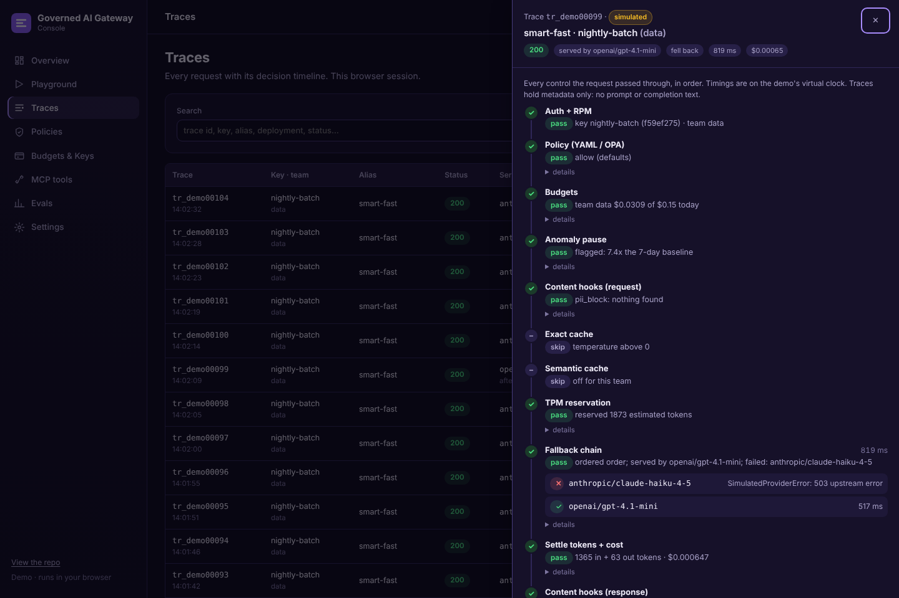

# Console

The console is the gateway's operator interface: one static application that shows every spend, policy, routing and tool decision the gateway makes, and lets an operator change the controls behind them. This document describes the sample business it is set in, its two run modes, its screens and the endpoints each screen uses. For the gateway itself, see the [README](../README.md) and [architecture](architecture.md).

**[Open the hosted console](https://coreymathie.github.io/governed-ai-gateway/demo/)**

## Sample business

The console is set in a sample business so the gateway can be judged at the scale it would run at: **Cypress Harbor Credit Union**, a *fictional* credit union whose seven teams (member services, digital banking, risk analytics, lending, compliance, IT, marketing) run eleven AI applications through the gateway with monthly budgets. It opens on **Spend**, the view a FinOps or AI-gateway product leads with, with the **Requests** log next to it.

- **Usage**: 90 days of traffic and spend from [scripts/generate_sample_company.py](../scripts/generate_sample_company.py).
- **Request log**: 500 requests from October 1 to 7 from [scripts/sample_requests.py](../scripts/sample_requests.py), each with the fields and decision stages the gateway records for a real one ([router/traces.py](../router/traces.py)). Costs are tokens times list prices; each team's cost per 1,000 requests lands within 30% of the usage file's assumption, budgets in each trace are the team's month-to-date spend from the usage file, and the October 6 Anthropic overload and the October 2 contractor-policy refusal in the activity feed are the requests they describe ([tests/test_sample_requests.py](../tests/test_sample_requests.py)).

Both files are seeded, checked in CI and labelled **Sample** everywhere, apart from **measured** results and the **simulated** requests sent in the tab. Spend and Requests render from those files immediately; the screens that run the gateway's code wait for Pyodide and say so.

## Run modes

One static app in [demo/](../demo/) has two adapters behind the same interface ([demo/adapters.js](../demo/adapters.js)). The header badge states which one is running, and anything simulated is labelled as such.

| Mode | Adapter | What runs | Where |
|---|---|---|---|
| **Demo** | `DemoAdapter` | The gateway's own `router/*.py` modules (policy, budgets, breakers, fallback chain, anomaly thresholds, PII hooks, caches, MCP tool policy, showback, config validation) in the browser via Pyodide 0.26.4, with [demo/engine.py](../demo/engine.py) supplying **simulated** providers. No API keys, no provider calls. | GitHub Pages |
| **Live** | `LiveAdapter` | The gateway's HTTP API. | `/console/` on a running gateway |

The mode is chosen by `?mode=demo|live`, otherwise auto-detected through the public `GET /console/api-mode`.

In demo mode the console loads these modules unchanged: `breaker`, `fallback`, `latency`, `tokens`, `budgets`, `anomaly`, `costs`, `showback`, `pii`, `policy`, `semcache`, `mcp_policy`, `configcheck`, `traces`, plus `models` on demand with Pyodide's pydantic to validate `routes.yaml` with the gateway's `RouterConfig`. `tests/test_demo_engine.py` checks the list and fails if one of them gains a third-party import at module level. The **Settings** screen lists the files running in the browser with their hashes.

Demo mode simulates providers, time (a virtual clock) and the hours before "now" on its overview chart; its budgets are scaled down so they can be hit. Live mode with `ROUTER_MOCK_PROVIDERS=true` simulates providers only.

### Run it live

`docker compose up`, then open http://localhost:4000/console/. Compose builds the gateway with `ROUTER_MOCK_PROVIDERS=true` ([router/mock_provider.py](../router/mock_provider.py)): every provider call is answered in-process by a **simulated** OpenAI-compatible provider, and MCP tool calls go to simulated MCP servers ([config/mcp.mock.yaml](../config/mcp.mock.yaml)), so it needs no API keys and calls nothing. Costs in that mode are simulated token counts at the configured prices. The admin key is `ROUTER_ADMIN_KEY` from `.env`, or one generated on first start: `docker compose exec gateway cat /data/admin-key.txt` (never logged). Set `ROUTER_MOCK_PROVIDERS=false` and provider keys to route real traffic.

Without Docker, `ROUTER_MOCK_PROVIDERS=true uvicorn router.main:app --port 4000` does the same.

### Run the in-browser console locally

Run `python -m http.server 8000` from the repository root, then open `http://localhost:8000/demo/` (Pyodide loads from jsDelivr). The hosted link needs GitHub Pages enabled for the repository (branch `main`, folder `/`).

## Audience views and navigation

**Business and technical views.** The header switch (or `?view=technical`) chooses the audience. The business view shows apps, teams, models by name, outcomes ("Answered after fallback", "Refused by policy") and a plain-language account of each request; the technical view adds keys and fingerprints, route aliases, token counts, stage names and timings, stage details and the raw record. Light and dark themes follow the system and can be switched in the header.

**Navigation.** Screens are grouped by job (Monitor, Operate, Govern, Configure) with sub-pages, breadcrumbs, a command palette (<kbd>Ctrl</kbd>/<kbd>⌘</kbd> <kbd>K</kbd> or <kbd>/</kbd>) over screens and actions, `g` + letter shortcuts (<kbd>?</kbd> lists them), a collapsible sidebar, and a guided tour offered on the first visit.

## Screens

| Screen | What it does | Live endpoints |
|---|---|---|
| **Spend** | For the sample credit union over 7, 30 or 90 days: AI spend against team budgets, requests served, cost per 1,000 requests, cache savings, success rate with fallback rescues, spend stopped by an anomaly pause, policy decisions enforced and regulated requests kept on-prem, each against the previous period; October so far by team with the month-end forecast against budget; latest requests; daily spend by team; budgets by team; spend by model; provider incidents; governance checks; recent activity linked to the requests it describes | `demo/data/sample_company.json`, `demo/data/sample_requests.json` |
| **Spend › This session** | Spend by team and model, requests, fallback rate, cache savings, anomaly flags, open circuits; spend per hour vs. each hour's 7-day average; guided "what to try" cards | `GET /admin/overview` |
| **Requests** | The sample company's request log: search, filter by team, outcome, model and day, page through, export CSV. Each request opens a page with what happened in plain words, cost, response time and gateway overhead, the model that answered and any failed attempt, the team's budget, every control it passed in order, recent requests from the same app, and (technical view) key fingerprint, stage details and the raw record | `demo/data/sample_requests.json` |
| **Requests › This session** | Requests sent in this tab (demo) or handled by the gateway (live), filterable by team, outcome and free text; a drawer with the full decision timeline: auth → policy/OPA → budgets → anomaly → PII hooks → exact and semantic cache → TPM → each fallback attempt with its breaker state → cost settle → response hooks → content log. Deep-linkable (`#/traces/<id>`), browser back closes it | `GET /admin/traces`, `GET /admin/traces/{id}` |
| **Playground** | Send a chat request as any app key and alias and see who answered, what it cost and each stage it passed; compare two routes side by side over N runs; take a simulated provider down (outage, 429s, error rate, latency) and watch breakers open, fall back and recover; semantic-cache playground (demo) | `/v1/chat/completions`, `/admin/mock/providers`, `/admin/circuits`, `/admin/circuits/reset` |
| **Policies** | Edit `config/policies.yaml`, `routes.yaml` and the MCP file; validate with the gateway's own loaders (errors inline with line numbers); preview every team × route decision against the active policy before applying; apply and re-run a request | `GET/PUT /admin/config/{name}`, `POST /admin/config/{name}/validate`, `POST /admin/policies/dry-run` |
| **Budgets & Keys** | Org and team caps and TPM (editable), create/revoke app keys (secret shown once), pause/unpause keys and override an anomaly pause for the hour, showback table and CSV export | `/admin/budgets/{scope}/{name}`, `/admin/keys/{id}/pause`, `/unpause`, `/admin/showback` |
| **MCP tools** | Team × tool allow-list, try allowed, denied and velocity-limited tool calls, audited (redacted) arguments | `GET /admin/mcp`, `POST /mcp/{server}`, `GET /admin/audit?category=mcp` |
| **Evals** | Route cost-vs-quality scorecard and CI gate example (simulated profiles), semantic-cache calibration (measured on the bundled pairs, re-runnable in the browser), test inventory | `demo/data/*.json` from [scripts/build_console_data.py](../scripts/build_console_data.py) |
| **Settings** | Admin key (kept in the tab's session storage unless the operator chooses to remember it), roles, gateway controls (breakers, auto-pause, caches, PII hook mode per team), the files running in the browser with their hashes, guided tour | `GET /admin/policies`, `/admin/semantic-cache` |

The month-end forecast on **Spend** projects each team's month-to-date spend at its current daily rate over the sample data; the gateway API itself has no forecasting endpoint (see [controls mapping](controls.md#finops-for-ai)).

## Verification

`python scripts/demo_smoke.py --both` drives every screen in headless Chromium in both modes; `--pyodide-dir` serves a local copy of Pyodide instead of jsDelivr, and `--screenshots` writes desktop and 390 px screenshots. Results are in [evaluation](evaluation.md#console-smoke-test). CI runs the live smoke and the demo smoke; the demo run is allowed to fail on CDN problems.

The older server-rendered dashboard is still at `/dashboard` and links to the console.
